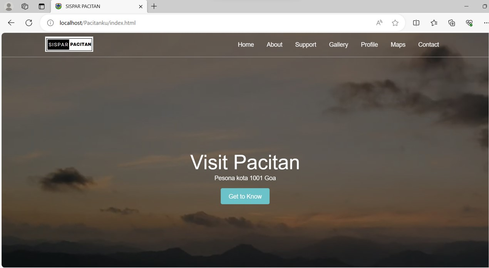
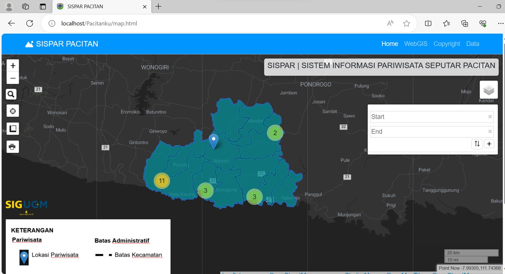
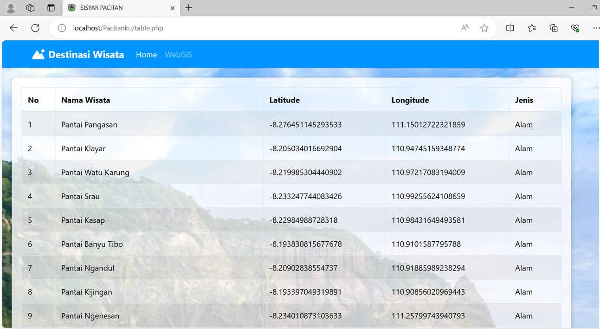

# SISPAR PACITANKU
>Link Video: https://youtu.be/2Zk4T43GYFk?si=b1ldH3zafPUfoUqf

>**SISPAR PACITANKU**

>SISPAR Pacitanku merupakan sebuah Platform yang digunakan sebagai sarana dalam branding pariwisata mencakup WEBGIS dan tampilan Landing Page.

>**Komponen Pembangun**

>Beberapa komponen yang ditampilkan diambil dari database PHP MyAdmin, Library LeafletJS, Bootstrap, File GeoJSON, dan Plugin pada muka Peta

>**Manfaat & Tujuan**
1. Menarik minat wisatawan terhadap pariwisata alam
2. Menampilkan wisata dan lokasi berbasis online dan mudah digunakan
3. Sebagai city Branding Kabupaten Pacitan

>**Sumber Data**
1.[Beberapa Pesona Wisata Kabupaten Pacitan](https://www.liputan6.com/hot/read/5083678/23-tempat-wisata-di-pacitan-selain-gua-cocok-untuk-wisata-keluarga-dan-nongkrong)

>**Screenshot Website**
>
>
>

# responsi_pgweb
